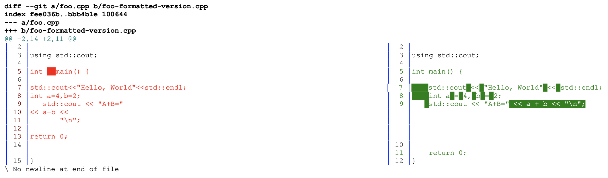

# `format-diff.sh`

A script to compare a C++ source code file against the `clang-format` formatted version and provide a color side-by-side comparison in PDF format.



Useful to see how well a file was formatted, and where problem areas may be, but without modifying the file itself.

## Installation

To install on a linux/UNIX type system, place the shell script "format-diff.sh" somewhere and give it execute permissions:

```bash
chmod +x format-diff.sh
```

Then, if you want to make it easily runnable system-wide, you can place a link in a directory that is in the system PATH.  For example, by running the following command from the directory containing the "format-diff.sh" script:

```bash
ln -s $(pwd)/format-diff.sh /usr/local/sbin/format-diff
```

### Dependencies

This script requires that you have the following tools available on your system:

* `delta` : https://github.com/dandavison/delta  -- provides the simple, color diff.
* `aha` : https://github.com/theZiz/aha  -- converts the from ANSI console output to HTML as an intermediate representation.
* `wkhtmltopdf` : https://wkhtmltopdf.org/  -- converts the HTML version to PDF.

## Usage

`format-diff.sh` _`sourceFile.cpp`_

The _`sourceFile`_ should be a C++ source or header file.  A PDF named e.g. "sourceFile_format-diff.pdf" will be created in the same directory.

## License

The MIT License (https://opensource.org/license/mit/)

Copyright 2023 Jason L. Causey

Permission is hereby granted, free of charge, to any person obtaining a copy of this software and associated documentation files (the “Software”), to deal in the Software without restriction, including without limitation the rights to use, copy, modify, merge, publish, distribute, sublicense, and/or sell copies of the Software, and to permit persons to whom the Software is furnished to do so, subject to the following conditions:

The above copyright notice and this permission notice shall be included in all copies or substantial portions of the Software.

THE SOFTWARE IS PROVIDED “AS IS”, WITHOUT WARRANTY OF ANY KIND, EXPRESS OR IMPLIED, INCLUDING BUT NOT LIMITED TO THE WARRANTIES OF MERCHANTABILITY, FITNESS FOR A PARTICULAR PURPOSE AND NONINFRINGEMENT. IN NO EVENT SHALL THE AUTHORS OR COPYRIGHT HOLDERS BE LIABLE FOR ANY CLAIM, DAMAGES OR OTHER LIABILITY, WHETHER IN AN ACTION OF CONTRACT, TORT OR OTHERWISE, ARISING FROM, OUT OF OR IN CONNECTION WITH THE SOFTWARE OR THE USE OR OTHER DEALINGS IN THE SOFTWARE.
